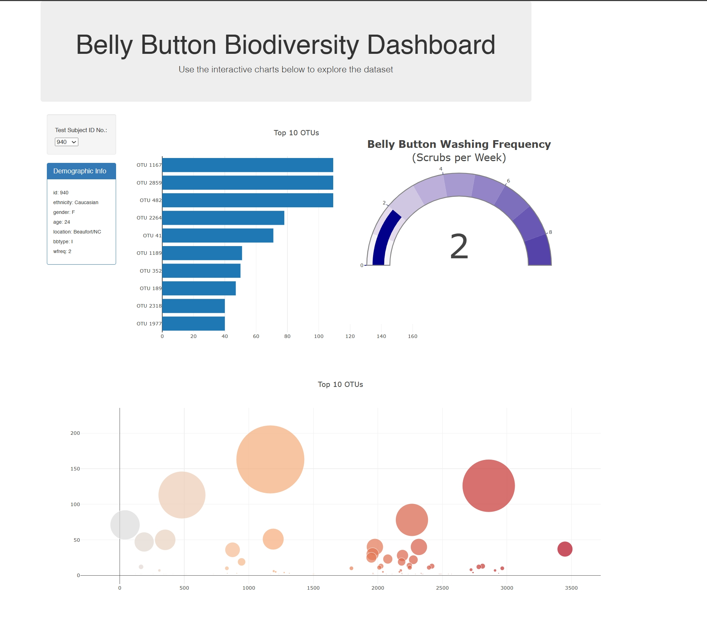

# Belly Button Biodiversity Dashboard

## Overview

The Belly Button Biodiversity Dashboard is an interactive web application designed to visualize the microbial species (also called operational taxonomic units, or OTUs) found in individuals' navels. The project aims to explore the biodiversity of belly buttons and provide insights into the various bacterial species present.

## Features

- **Dropdown Menu**: Select a test subject's ID to view their specific microbial data.
- **Demographic Info Panel**: Displays selected test subject's demographic information.
- **Bar Chart**: Shows the top 10 OTUs found in the selected individual.
- **Bubble Chart**: Visualizes the relative frequency of all microbial species found in the selected individual.
- **Gauge Chart**: Represents the belly button washing frequency of the selected individual.

## Live Dashboard

You can access the live dashboard of the Belly Button Biodiversity Dashboard [here](https://reiannaliu.github.io/belly-button-challenge/).

## Data Source

The data used in this project is based on a research study that sampled the biodiversity of belly buttons. The dataset includes information on various microbial species found in individuals' navels and their respective frequencies.

## Getting Started

To run the Belly Button Biodiversity Dashboard locally:

1. Clone the repository to your local machine.
2. Navigate to the project directory.
3. Open `index.html` in your preferred web browser.

## Contributing

Contributions are welcome! Please read the contribution guidelines before submitting a pull request.

## License

© 2022 edX Boot Camps LLC. Confidential and Proprietary. All Rights Reserved.

